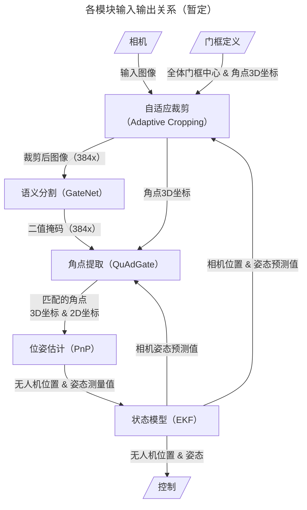

# MonoRace Perception

## 目录结构
### `assets`
测试用数据

### `modules`
模块列表

### `test`
单元测试代码

### `utils`
模块用到的工具类

## 输入输出

> [!NOTE]
> * 部分参数（包括相机内外参）未列出，详见[`github.com/Xyc1596/monorace_perception/utils/exp.py`](utils/exp.py)（WIP）
> * 无人机和相机位姿等状态量预测和测量值均封装为`utils.exp.DroneState`类（WIP）

